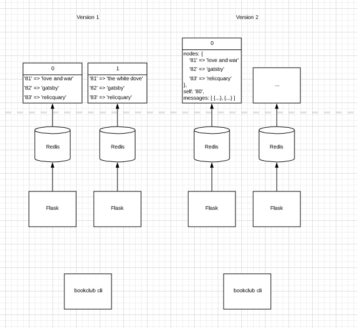
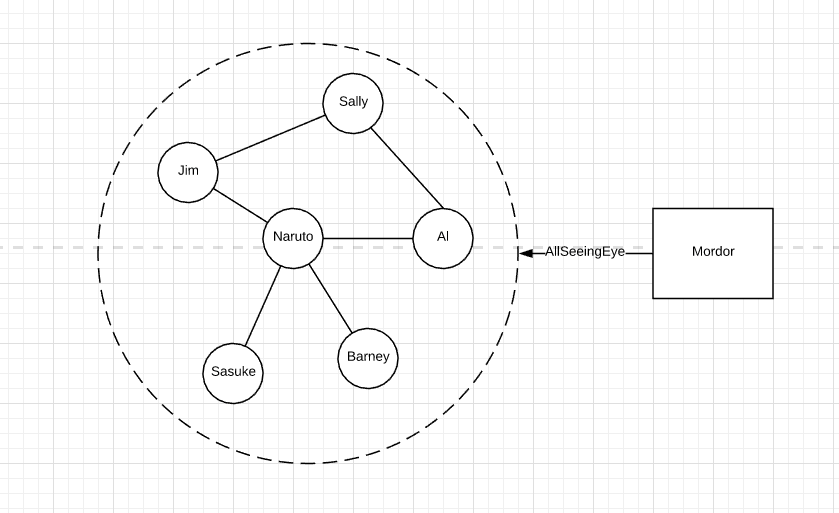

# Suggested strategy:
* Start by defining your message format (write out some example messages)
* Figure out the state that each node needs to hold
* Write up your message update logic—upon receiving a gossip message, how do you update your view of the world? You should be able to run this on your example message and get a correct state transition.
* Then write a little UI code so you can easily inspect what each node is doing.
* Then write your networking and gossip logic, and test across multiple nodes!

NOTE: Observing and debugging distributed systems can be hard. I recommend investing in your UI: try adding some colors and an organized table to display your state for each node. It'll make debugging a lot easier.

# Message Format
* UUID (for deduplication)
* Originating port (your identity)
* Version number
* TTL
* Payload

{
  uuid: 'asdijfaojf3232',
  address: '196.18.1.0'
  port: '80'
  ttl: 4 # decremented each time it is forwarded
  payload: 'bookname'
}

# Information on the UI
We should display:
1. what the current node thinks the global state is (what the favorite books are)
2. what the list of peers is, what their names are, or ports are

activity
current messages

books table
node name | node port | favorite book
----------+-----------+--------------
jimmy     | 81        | gatsby
----------+-----------+--------------
tod       | 82        | blah

etc.

# Testing
1. we might want some kind of 'god' project that can 'freeze' all the running processes at once
2. we are going to want some process management anyway, to add and kill processes as we go, so we need some code that creates new nodes on demand, I'm not quite sure how to bootstrap--we have two options here, we should be able to pass in a port via a command util--so I can manually manage the project, the other approach would be... to have this automated
3. but basically for the use case I want to do something like...

`watercooler new jimmy:81`

# Approach
There are three components:
1. the flask servers
  a. periodic update per server
  b. gossip logic
  c. serve react client
2. cli
  a. create new nodes
  b. stop all processes

1. How do I manage multiple flask processes?
2. What logic should I have to implement the features of a gossip protocol

First I need to handle the areas that I think are going to be the most confusing. Maybe the first iteration is: spin up flask servers on demand listening on different points that is watercooler 1.0

Then I want to implement the basic gossip logic in one of the servers and have it ping some listener. Or I could implement a simple UI to visualize some of that data.

# Components
1. bookclub: cli app for command and control, onboard new nodes
2. members: flask gossiping node

# Iterations
1. create a single member that posts a new favorite book every 10 seconds
  - wire up flask member
  - wire up inclusion of react client
  - flask & apscheduler
2. create a cli app to onboard new members
  - click
3. implement gossip logic
4. how do I test?
  1. clean up state?
  2. clean up processes?
5. Move flask to class based and run app creation through CLI

# (1930)
I've set up flask. I've added a few endpoints to get the current nodes book. I've added a dashboard to fetch what the node _thinks_ is the favorites of everyone.

Now I'm getting into the multi node problem. So, I should build a simple 'bookclub' CLI app that can help manage this for me.

# (2112)
1. Okay, I need to move to version 2 of my design in lucid chart. So that it's easier to refactor my data.
2. It would be great to refactor my codebase as a set of class based views so I can separate things out better.
3. It'd be great to add some tooling around cleaning up redis and processes through a cli app
4. It'd be sweet to create a Monitor App that shows 'real time' interactions on teh network, basically everytime a node does something on the network I can publish it to an event app, then have it push updates maybe to a react application???

# April 9 20:00

I'm trying to setup of Sauron with a database to store requests within: https://realpython.com/flask-by-example-part-2-postgres-sqlalchemy-and-alembic/

I'm a bit concerned about time at this stage. The way I'd like to proceed is to write unit tests for Sauron's API, the eye, and a simple dashboard that just display an index view of saved requests.

# April 10th 18:13
I'm going to get my test network up first so I can understand my development process. MVP is just a list of requests that happen over time.
